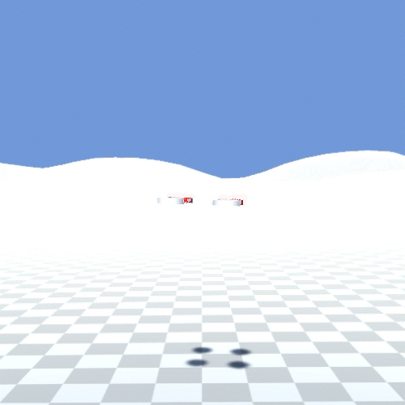

# Drone simulator

A super simple quad copter drone simulator done in Unity. My son and I learned a lot in putting this together.

This is inspried by a presentation by Ryan Boland [Embedded Programming for Quadcopters](https://www.youtube.com/watch?v=CHSYgLfhwUo&t=2382s&ab_channel=Code%26Supply). This presentation is an accessible technical overview of how quad copters work.

I'm sure there are more sophisticated control algorithms out there but there's enough here to get a good idea of how things work without overly simplifying things.

* Requires an Xbox controller, which is setup with a standard quad copter control scheme. A button switches to FPV. Y button resets to starting position.

* Simulates the use of a gyro by integrating rigid body's angular velocity to get orienation, assuming no drift.

* Uses a PID controller on yaw, pitch and roll. Actually, only PI (no D). The control scheme follows Ryan's presentation, except that angular velocity is added when computing error. The intuition here is that if the platform is already rotating in the direction you intend to rotate you don't want to add as much input. This vastly improves the control of the quadcopter, and I think is fair game given the gyro.

* Simulation is driven by applying forces and torques given position of the motors wrt to the center of the rigid body. Unity's physics engine does the rest.

* It's pretty fun to fly!

